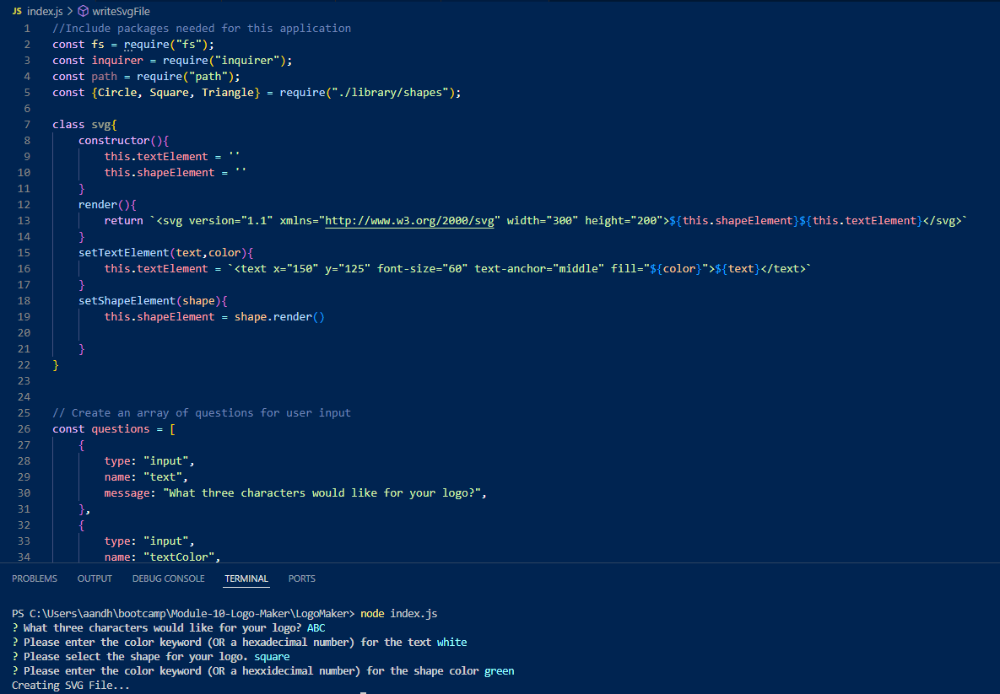

# LogoMaker
by Heather Weltzien

## Table of Contents
* [Description](#description)
* [Installation](#installation)
* [Usage](#usage)
* [Credits](#credits)
* [License](#license)
    
## Description
    After utilizing web-based resources and instructional support, I learned how to use node to interact with the file system, create an array of user input, handle file paths, and export an SVG file. First, I installed "inquirer" and generated an array of user input. Then, I provided a function to write the SVG file and initialize the app in index.js. From there, the purpose of "shapes.js" is to loop the data through the constructor function and export the module to the "dist" folder. Moreover, this LogoMaker simplifies the process of creating a logo and eliminates the need to consult a graphic designer. 

## Installation
    Run npm install in the terminal.
    
## Usage
    Run node index.js in the terminal.
    
## Credits
<ul>    
    <li>Tutoring session with Alistair Rowden</li>
    <li>Office hours with Erik Hirsch</li>
    <li>Office hours with Anthony Barragan</li>
    
</ul>    

## License
    none

# [link to walkthrough video](https://drive.google.com/file/d/1O4_k8bcw4tO9XFak30HrLaVqsysWNVfF/view)